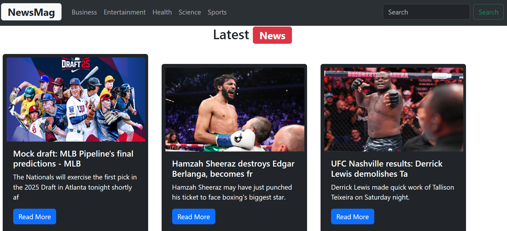

# 🗞️ NewsApp - React News Aggregator

A modern and responsive news web application built using **ReactJS** and **Bootstrap**. It fetches real-time news from **NewsAPI**, and allows users to browse news across multiple categories like Sports, Health, Entertainment, and more. It also provides a fallback image when the article image is missing.

---

## 🚀 Features

- 📰 Category-wise news (Sports, Health, Entertainment, etc.)
- ⚡ Real-time news fetching using NewsAPI
- 🖼️ Fallback image for missing article thumbnails
- 🔄 Loading spinner during fetch
- 📱 Fully responsive using Bootstrap
- 🧩 Modular component-based architecture

---

## 🛠️ Tech Stack

- ReactJS
- Bootstrap 5
- NewsAPI
- Fetch API / Axios

---

## 📁 Project Structure (Modular Architecture)

<pre><code>```

news-app/
├── public/
│   └── index.html
│
├── src/
│   ├── assets/
│   │   └── newsicon.png            # Fallback image for missing article thumbnails
│   │
│   ├── components/
│   │   ├── Navbar.jsx              # Navbar with category buttons
│   │   ├── NewsBoard.jsx           # Fetches and renders news articles
│   │   └── NewsItem.jsx            # Individual news card UI
│   │
│   ├── App.jsx
│   ├── App.css
│   ├── index.css
│   └── main.jsx
│
├── screenshots/                   # ✅ Add this folder for project screenshots
├── screenshots/                   # Added this folder for project screenshots
│   ├── homepage.png
│   └── newscard.png
│
├── .env                           # API key goes here
├── package.json
└── README.md
```</code></pre>

## 📸 Screenshots

| Business | Sports |
|-----------|-----------|
|  |  |

|  |  |


🧪 Future Improvements
🔍 Add search functionality
🔄 Add infinite scrolling or pagination
🌙 Dark mode toggle
🌐 Multi-language support
✅ Add unit testing
